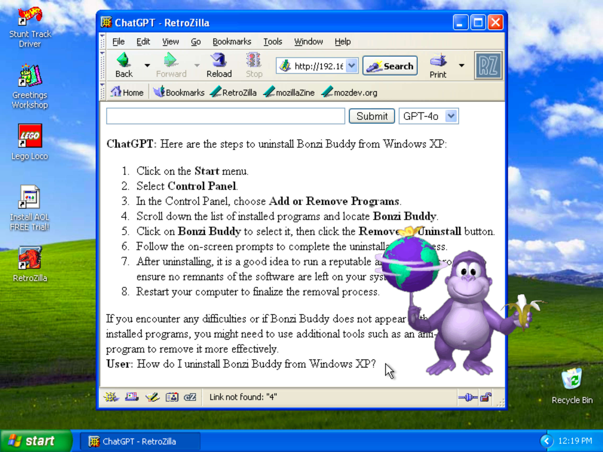

# GPT_HTTP (ChatGPT for Vintage Web Browsers)

GPT_HTTP is a Flask-based web application that lets users interact with OpenAI's GPT models through a web interface.
It is designed to be compatible with vintage systems, including early Macintoshes, by formatting responses with characters and HTML tags suitable for older machines.
<hr>





## Setup Instructions

### Prerequisites

- Python 3.x
- OpenAI API key

### Installation

1. Clone the repository:

   ```bash
   git clone https://github.com/hunterirving/gpt_http.git
   cd gpt_http
   ```

2. Set up the virtual environment:

   ```bash
   python3 -m venv venv
   source venv/bin/activate
   ```

3. Install the required packages:

   ```bash
   pip install -r requirements.txt
   ```

4. Configure your OpenAI API key:

   - Create a `config.py` file in the root of the project directory.
   - Add your OpenAI API key to `config.py`:

     ```python
     open_ai_api_key = "your_openai_api_key"
     ```

5. Run the Flask application:

   ```bash
   python3 gpt_http.py
   ```

6. Access the application:

    Open a web browser on your vintage machine and navigate to ```http://<ip_address_of_flask_server>:8080```,

    Replace <ip_address_of_flask_server> with the actual IP address of the machine running the Flask server. Ensure both machines are connected to the same network.

### Deactivating the Virtual Environment

When you're done working with this project, deactivate the virtual environment with:

```bash
deactivate
```

### .gitignore

Ensure your .gitignore file includes the following entries to avoid committing sensitive information, virtual environment files, and unnecessary cache files:

```
config.py
venv/
__pycache__/
```

## Contributing

Feel free to submit issues or pull requests for improvements and bug fixes.

## License

This project is licensed under the [GNU General Public License v3.0](LICENSE.txt).